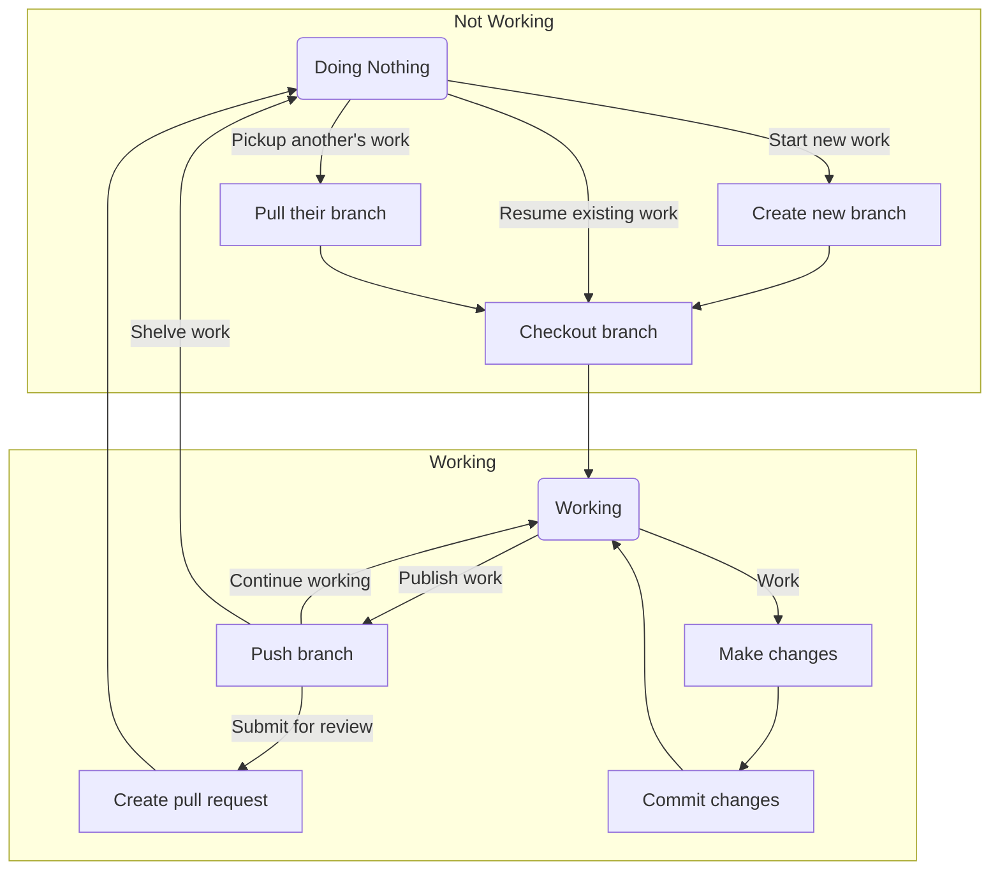

# Git flow
## General Usage

## Starting different kinds of branches

What kind of work needs doing? | Branch to start from | Branch to merge to | Branch prefix
-|-|-|-
A new feature | `dev` | `dev` | `feature/`
A bug fix for a critical problem on live | `master` | `master` & `dev` | `hotfix/`
A bug fix for a problem on dev or a non-critial problem on live | `dev` | `dev` | `bugfix/`
A bug fix for a critical issue found while UAT testing | `release/...` | `release/...` & `dev` | `bugfix/`

Before starting new work, you should insure the branch you are starting from is up to date.

### Features
Normally each new user story will describe a new feature and be implemented on it's own feature branch.
New features are always started from the dev branch,and merged back to the dev branch (through a pull request)
New features are only released to the client via the release process.

### Bugfixes
Depending on the severity of the bug and where the bug is present there is 3 diffrent ways the bugfixing is done

#### - Bugs on `dev`
If the bug is a problem that exists on `dev`, but not `master`; or the bug exists on `master`, but is not critical, then the bug fix is done on the `dev` branch. These bug fixes are done in much the the same way that a feature is done, but often prefixed with `bugfix/` instead of `feature/`.

#### - Bugs on `master` (hotfixes)
If the bug is a critical problem on `master`, then a hot fix is done. The hot fix branch starts off the master branch, is prefixed with `hotfix/` and when it's completed, is merged to both `dev` and `master`. After being merged into master, the bug fix is released to the client.
For more information see hotfixes.

#### - Bugs on `release/...`
If the bug is found during the release process, then a bug fix branch should be created off of the release branch. Once the work is done, the bug fix should be merged back into the `release/...` branch and `dev`. Finally the release process can be continued.

## Doing a Release
A "release" here refers to the whole release process of:
1. Feature locking the sprint
2. Building a version for testers to test
3. Fixing any critial bugs found
4. Building the Release version
5. Ending the Release procedure

Actually giving the release to the client is out of the scope of this document as it varies based on deployment methods.
This guide covers the manual process of doing release branches, which could be automated.

### Feature locking the sprint
Once a release has been started no new features should be included in what will be released, this is know as feature locking. Feature locking is important for two reasons, it prevents your test team having to account for new features that they don't have time to test, and it helps focus the dev team into fixing the critical bugs.
Feature locking in git flow is done by creating an isolated release branch.
1. Insure `dev` is up to date.
    `git fetch origin dev:dev`
3. Branch `dev` to create the release branch, release branches are named according to the scheme `release/<version>`.
    `git branch release/<version> dev`
4. Push the release branch.
    `git push --set-upstream origin release/<version>:release/<version>`

### Building the latest version
Build definitions should be made configurable so they can point to the required release branches instead of a static branch.
You may also want to either manually or automatically update the version number for each build to help keep track (see discussion on versioning)

### Fixing any ciritical bugs found
See [Bugs on release](#bugs-on-release...) above for how to resolve a bug found on the release branch.
Once resolved the branch can be built again as before.

### Building the Release version
Before building the release version insure the final version number and other meta data is set correctly, the proceed to do the build with the correct enviroment.

### Ending the release Procedure
Once the release is completed the release branch needs to be merged to both `master` and `dev`, then the branch can be deleted.

#### - Merging the branches
The easiest way to do the merges is via the pull request system, as this will allow it to work without needing to edit permissions. However super admins, or scripts, should use the manual system described below.
Regardless of the system used it is very important to note that this method **should not be followed** if there is merge conflicts, as something has gone terribly wrong.

1. Checkout the `master` branch `git checkout master`
2. Insure it is up to date `git pull`
3. Insure the release branch is up to date `git fetch origin release/<version>:release/<version>`
4. Merge the release branch into master `git merge --no-ff release/<version>`
    * The `--no-ff` flag signifies that a new merge commit should always be created, even if a fast forward is possible, this is necessary to preserve the history structure.
5. Push the master branch `git push origin master`

Then repeat these steps for the `dev` branch (swapping out all cases of `master` for `dev`)

#### - Deleting the release branch
1. Delete locally `git branch --delete release/<version>`
2. Delete remote branch `git push origin :release/<version>`

<!--stackedit_data:
eyJoaXN0b3J5IjpbODk2MDA2NDQzXX0=
-->